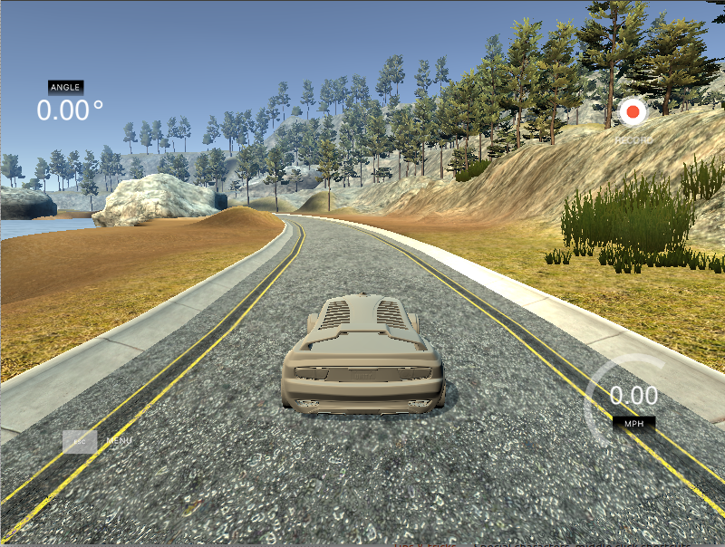

# **Behavioral Cloning**

---

**Behavioral Cloning Project**

The goals / steps of this project are the following:
* Use the simulator to collect data of good driving behavior
* Build, a convolution neural network in Keras that predicts steering angles from images
* Train and validate the model with a training and validation set
* Test that the model successfully drives around track one without leaving the road
* Summarize the results with a written report

## Rubric Points
### Here I will consider the [rubric points](https://review.udacity.com/#!/rubrics/432/view) individually and describe how I addressed each point in my implementation.  

---
### Files Submitted & Code Quality

#### 1. Submission includes all required files and can be used to run the simulator in autonomous mode

My project includes the following files:
* model.py containing the script to create and train the model
* drive.py for driving the car in autonomous mode
* model.h5 containing a trained convolution neural network
* writeup_report.md or writeup_report.pdf summarizing the results
* video.mp4 video showing successful run using the model



#### 2. Submission includes functional code
Using the Udacity provided simulator and my drive.py file, the car can be driven autonomously around the track by executing

```sh
python drive.py model.h5
```

#### 3. Submission code is usable and readable

The model.py file contains the code for training and saving the convolution neural network. The file shows the pipeline I used for training and validating the model, and it contains comments to explain how the code works.

### Model Architecture and Training Strategy

#### 1. An appropriate model architecture has been employed

The model I used for this project is based on the NVIDIA model as presented in
the project introduction. The first layers perform normalization of the image in the range (-1, 1) and also cropping of the top and bottom sections of the image. There are 3 5x5 and 2 3x3 convolutional layers with RELU activation. Then 4 fully connected layer with two additional dropout layers to avoid overfitting. The
output is the predicted steering angle.

#### 2. Attempts to reduce overfitting in the model

I included two dropout layers after the first two fully connected layers with a keep probability of 0.5 to avoid overfitting (lines 83 and 86 of model.py)

Training and validation sets are split from the dataset 80% and 20% respectively.
A generator is used to produce batches of images from the three: cameras center,
left, and right. Additional augmentation is achieved by randomly flipping
images.

#### 3. Model parameter tuning

The model used an adam optimizer, so the learning rate was not tuned manually (line 107 in model.py).

#### 4. Appropriate training data

I began using my own generated data using the simulator with keyboard input. After several attempts of testing the model, I decided to try the dataset provided by Udacity. This dataset allowed the model to achieve a much better performance so
I kept it and created a generator function to provide augmented data.

### Model Architecture and Training Strategy

#### 1. Solution Design Approach

I started by just running a very simple model to make sure that the environment
was running correctly. Then, I jumped right in to implementing the NVIDIA
architecture as shown in the project introduction and described in detailed in
the other sections.

I trained the network using my own data but did not achieve the desired performance when testing on the simulator. I switch to using the dataset
provided by Udacity and was able to achieve a better performance. When testing
on the simulator, the car would stay on the track for the first segment of the
course, but was not able to stay on the road turning on the first curve. This
allowed me to think that with some work to the model a much better performance
could be achieved.

I modified the generator to use left and right camera angles selected at random
with the appropriate angle correction factor. I also introduce augmentation by
flipping the image randomly. I also introduced two dropout layers after the first
fully connected layers as described above to avoid overfitting. I  also tried improving the performance by increasing the size of the training data set up to 32,000.

At this point, the car was able to drive past the first curve and stay inside of
a safe area. Increasing the number of epochs to five produced a much better model
allowing the car to stay on track for several laps.

#### 2. Final Model Architecture

Final model architecture was based on the NVIDIA model with two dropout layer to avoid overfitting.

| Layer         		    |     Description	        					|
|:---------------------:|:---------------------------------------------:|
| Input         		    | 160x320x3 RGB image   							|
| Lambda Layer        	| (-1, 1) normalization output 160x320x3        |
| Cropping2D         		| Crops top/bottom sections output 65x320x3		  |
| Convolution 5x5     	| 2x2 stride, valid padding, outputs 31x158x24 	|
| RELU					        |	RELU activation					                      |
| Convolution 5x5     	| 2x2 stride, valid padding, outputs 14x77x36 	|
| RELU					        |	RELU activation					                      |
| Convolution 5x5     	| 2x2 stride, valid padding, outputs 5x37x48 	  |
| RELU					        |	RELU activation					                      |
| Convolution 3x3     	| 1x1 stride, valid padding, outputs 3x35x64 	  |
| RELU					        |	RELU activation					                      |
| Convolution 3x3     	| 1x1 stride, valid padding, outputs 1x33x64 	  |
| RELU					        |	RELU activation					                      |
| Fully connected		    | 2112x100 Fully connected layer      					|
| Dropout					      |	Dropout layer with 0.5 probability            |
| Fully connected		    | 100x50 Fully connected layer      						|
| Dropout					      |	Dropout layer with 0.5 probability            |
| Fully connected		    | 50x10 Fully connected layer        						|
| Fully connected		    | 10x1 Fully connected layer      							|

#### 3. Creation of the Training Set & Training Process

I ended up using the data provided by Udacity. To create the training and validation sets, the data is first shuffle and then split into 80% for training and 20% for validation. The generator using this data to create batches during training and using the left and right cameras and augmentation. This allows a larger amount of data to be created while training and not entirely bounded to the actual size of the dataset. Using validation data one can verify that the model is not overfitting.

Here is part of one lap around the first track:


